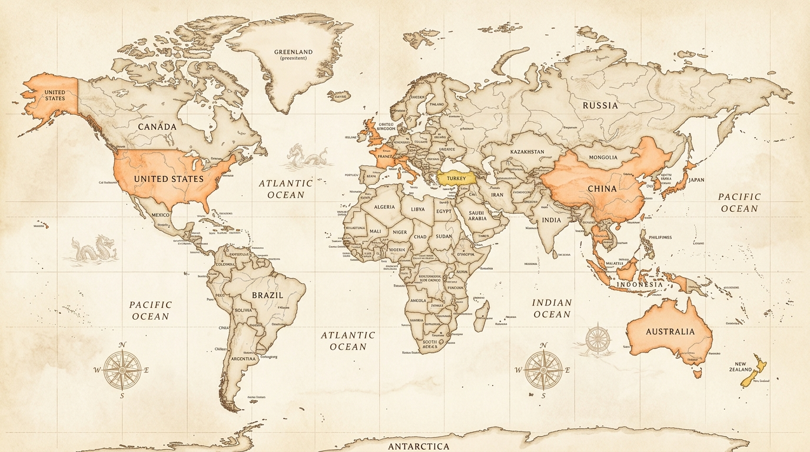

# Travelyn

**By Team Trail Never Ends**  
**Team Members:** Evelyn Ang, Angela Ngu Xin Yi, Chun Yao Ting, Teoh Xin Yee  
**Problem Statement:** Travel Planner  
**Video Presentation:** [Unlisted Youtube Link](https://youtube.com)  
**Presentation Slides:** [Public Link](https://canva.com)  

---

## 1. Project Overview

### The Problem
Group travel planning is messy and exhausting because it is scattered across too many apps. Friends debate in chat groups, build itineraries in spreadsheets, calculate expenses in separate finance apps, search booking sites, and lose photos in cluttered camera rolls. This causes planning fatigue, arguments over different travel styles, and awkward math when splitting foreign dinner receipts with taxes and service fees.

The main stakeholders are group travelers, friends, and trip planners who want a stress-free way to coordinate. Existing apps like Wanderlog, Splitwise, and Polarsteps each only solve one piece of the puzzle—leaving users to manually jump between apps with no unified experience.

### Our Solution
Travelyn is an all-in-one collaborative travel app that makes planning, booking, and experiencing trips with friends effortless and fun. Guided by Trippy, a friendly animated explorer mascot, the app helps groups vote on trip vibes, follow dynamic daily itineraries, and manage flights, stays, and trains in one place. It also eliminates bill-splitting stress with instant receipt photo scanning and turns every stop into retro Polaroid memories and passport badges.

### Feature-Set:
* **Vibe Voting:** Group members vote on trip styles (Foodie, Culture, Chill, Adventure) to easily build a shared itinerary.
* **Smart Daily Itinerary:** Step-by-step schedules with walking times, location tips, and detour suggestions.
* **Surprise Me Generator:** One-tap spontaneous mini-adventures for unexpected free time.
* **AI Receipt Scanner & Bill Splitter:** Snap a photo of physical receipts to automatically extract items, taxes, and split costs fairly across currencies.
* **All-in-One Booking Hub:** Search and track stays, flights, and trains tailored to your itinerary.
* **Polaroid Camera Check-Ins:** Capture moments at landmarks to create vintage stamped Polaroid memories in your trip diary.
* **Explorer Passport:** A gamified world map with country stamps, XP ranks, and achievement badges.
* **Community Forum:** Discover local recommendations, transit tips, and hidden gems from other travelers.

---

## 2. Ideation & Process

### 2.1 Ideas We Considered

| Idea / Feature | Status | Why it was Kept / Dropped |
| :--- | :--- | :--- |
| **AI Travel Companion & In-Trip Planning** | **Kept (Core)** | Chosen as a key feature because the AI companion supports travelers throughout the trip, not just during the planning stage. It provides contextual recommendations, itinerary guidance, reminders, route suggestions, and warnings based on the user's current trip plan and situation. Risk detection identifies potential issues like delays, closures, bad weather, or scheduling conflicts to suggest suitable alternatives. |
| **AI Group Preference Matching & Conflict Resolution** | **Kept (Core)** | Solves conflicting group preferences by combining members' travel styles, budgets, and interests to identify compatible activities and create a balanced trip, rather than relying only on manual voting. |
| **Automatic Trip Re-planning & What-If Simulation** | **Kept (Core)** | Adapts the itinerary when plans change. Users can either respond to real-world disruptions or explore hypothetical changes and observe how they affect the rest of the itinerary. |
| **AI Itinerary Generation & Personalized Recommendations** | **Kept (Core)** | Provides the initial trip plan while personalized recommendations fill it with suitable activities and places. Integrated directly into the planning process instead of being a separate generic tool. |
| **AI Receipt Scanning, Expense Splitting & Budget Tracking** | **Kept (Core)** | Forms one complete expense-management workflow: receipt scanning extracts expenses, expense splitting determines who owes what, and budget tracking monitors spending against the planned budget. |
| **Interactive Trip Map & Route Planning** | **Kept (Supporting)** | Provides a visual representation of the itinerary and helps users understand distances, routes, and travel times. |
| **Group Voting & Social Trip Chat** | **Kept (Supporting)** | Voting allows members to express preferences, while the shared chat keeps discussions, itinerary decisions, and AI suggestions in one place. |
| **Booking & Trip Readiness Checklist** | **Kept (Supporting)** | Reminds users about reservations, tickets, and other essential preparations before and during the trip. |
| **Real-Time Flight & Hotel Price Comparison** | **Kept (Supporting)** | Helps users make better booking decisions without manually checking multiple platforms, complementing itinerary and budget tracking. |
| **Booking Aggregation & Deep-Link Booking** | **Kept (Supporting)** | Compares available options and redirects users to established booking providers, avoiding the high overhead and compliance of an in-app payment processor. |
| **AI Travel Cost Prediction** | **Merged** | Merged into Expense & Budget Management because it overlaps with existing budget tracking functionality. Future costs are estimated using itinerary and historical data. |
| **Travel Simulation / Dependency Graph** | **Merged** | Merged into Automatic Trip Re-planning. Dependency logic is used internally to evaluate changes without exposing unnecessary UI complexity to the user. |
| **Multi-Language Travel Assistance** | **Deferred** | Moved to future development. Rather than building a separate language assistant, multilingual capabilities are directly integrated into existing AI features (e.g. receipt translation). |
| **Offline Travel Support** | **Deferred** | Moved to future development. Full offline sync requires dedicated infrastructure; basic local caching fallbacks are retained in the interim. |
| **AI Packing List Generator** | **Dropped** | Packing list generators are common and do not strongly differentiate the application from existing travel solutions. |
| **Personalized Destination Comparison** | **Dropped** | Overlaps with group preference matching and personalized recommendations without providing enough additional standalone value. |
| **Full In-App Booking System** | **Dropped** | Directly processing transactions introduces severe merchant, payment, cancellation, and compliance overhead. Aggregator deep-linking provides the required utility cleanly. |

---

### 2.2 Ideation Boards
*Our team mapped out user journeys, problem trees, and collaborative flows to refine our core features:*

```
[ Ideation Board / Mindmap / User Flow Diagrams ]
```
> *Figure 1: Exploration of group decision paralysis, travel expense pain points, and live in-trip AI assistance workflows.*

---

### 2.3 Mentor Consultation

| Date | Mentor | Feedback Received | What Was Changed |
| :--- | :--- | :--- | :--- |
| **01/09/2026** | **Teh Ming En** | There are too many features right now; focus on "wow features" to stand out from other solutions. User experience focus is a great direction, but requires dedicated work on UI refinement. | Reviewed and reduced our feature scope to focus on key "wow features" (especially the In-Trip Travel Companion). Shifted attention toward UI/UX refinement, simplifying user flows, and designing a cleaner interface. Less essential features were moved to future development. |
| **12/09/2026** | **Mah Qing Fung** | 1. UI is comprehensive.<br>2. When users have conflicts over a location, handling it directly in chat is better than commenting on implementation plans.<br>3. The check-in (打卡) feature is unique and special.<br>4. Demo should focus on Chat, Trip, and Diary.<br>5. Replanning is critical.<br>6. Deploy using Vercel. | Prioritized the live collaborative Chat Tab, dynamic Itinerary Tab, and Polaroid Check-in Diary for the primary demo flow. Ensured conflict resolution and detour suggestions trigger organically in chat. Prepared web deployment pipeline. |

---

## 3. Design & Prototype

* **Interactive Web Demo / UI Prototype:** [Public Link (Figma / Web Prototype / Vercel Demo)](https://travelyn-demo.vercel.app)

Travelyn’s design language is warm, tactile, and gamified—blending modern Flutter micro-interactions with nostalgic scrapbook aesthetics (washi tape, vintage Polaroid cards, postal stamps, and smooth harmonic mascot animations).

---

### 📱 Key Screens & Interactions

#### Screen 1: Mascot-Driven Vibe-Casting & Voting (`TripVotingScreen`)
```

```
* **Interaction:** Group members select up to 3 trip styles from a 3×3 card grid (*Foodie*, *Culture*, *Adventure*, *Chill*, *Hidden Gems*, etc.) featuring customized mascot illustrations. Tapping cards triggers haptic feedback, real-time avatar clustering shows member consensus, and tapping **"I'm Done! ✨"** advances to customized place selection.

#### Screen 2: Collaborative Chat & AI In-Trip Guidance (`ChatTab`)
```

```
* **Interaction:** A collaborative group feed anchored by a pinned trip overview card with realistic push pins. The AI companion (*Trippy*) injects contextual suggestion cards directly into the chat stream—such as nearby cafe swaps or bad-weather detour recommendations—with one-tap **"Apply"** or **"Keep"** action buttons.

#### Screen 3: Smart Step-by-Step Daily Itinerary (`TripTab`)
```

```
* **Interaction:** Displays an organized timeline with walking times, location tags, opening hours, and specialty dishes. Tapping any itinerary card slides up a comprehensive **Location Overview Sheet** with interactive maps, coordinates, and cultural notes.

#### Screen 4: Multimodal AI Receipt Scanning & Itemized Bill Splitting (`FinanceTab`)
```

```
* **Interaction:** Travelers snap or upload physical paper dining receipts. The dual **Google Cloud Vision + Gemini 2.5 Flash** pipeline extracts individual dishes, service charges, and regional taxes. Members tap line items to claim their share, and the system automatically computes minimal-transaction debt settlements across 11+ global currencies.

#### Screen 5: Live Viewfinder Camera Check-In (`TripCameraCheckinScreen`)
```

```
* **Interaction:** Travelers open an in-app live camera viewfinder with corner focus brackets and location badge pills at scheduled destinations. Tapping the large shutter button triggers a haptic white flash and smoothly transitions into the Polaroid keepsake creator.

#### Screen 6: Vintage Polaroid Keepsake & Memory Diary (`TripPhotoCheckinSuccessScreen`)
```

```
* **Interaction:** Snapping a check-in automatically renders a tilted, vintage **Polaroid memory card** decorated with washi tape, location geotags, timestamps, and a Trippy postal seal stamp. Tapping **"Keep Going! ✨"** logs the memory to the trip's permanent diary timeline.

#### Screen 7: Gamified "My Explorer Passport" & World Map (`ExplorerProfileHeader`)
```

```
* **Interaction:** An interactive 2D coordinate-projected World Explorer Map highlighting *Explored*, *Wishlist*, and *Someday* countries. Displays real-time explorer rank progression (*Wanderer* $\rightarrow$ *Globetrotter*), level XP meters, collectible country stamps, and unlockable achievement badges (*Peak Seeker*, *Foodie*, *Culture Lover*).

#### Screen 8: Spontaneous "✨ Surprise Me" Free-Time Generator (`FreeTimeBanner`)
```

```
* **Interaction:** Situated on the home dashboard, an animated peeking Shiba mascot detects downtime between planned stops. Tapping **"✨ Surprise Me"** generates instant, nearby mini-adventures with route details tailored to the traveler's free time.

---

## 4. What Makes It Different

Instead of forcing users to juggle separate spreadsheets, expense calculators, and booking sites, Travelyn brings planning, bill-splitting, booking, and memory keeping into one warm, gamified companion app.

### Novel Features & The Twist:

1. **Interactive Vibe Voting & Consensus**
   * **The Twist:** Instead of endless back-and-forth text messages, groups vote on a visual 3×3 grid of trip vibes (*Foodie*, *Culture*, *Adventure*, *Chill*, *Hidden Gems*, etc.).
   * **Why It's Original:** It visualizes group preferences in real time with member avatars and automatically synthesizes a balanced itinerary that satisfies everyone.

2. **AI Receipt Scanning & Itemized Bill Splitting**
   * **The Twist:** Uses vision AI to scan physical paper receipts in any language or currency.
   * **Why It's Original:** It breaks down individual dishes, taxes, and service fees so friends simply tap what they ate to split accurately, while automatically minimizing debt settlements across 11+ global currencies.

3. **Gamified Explorer Passport & Tactile World Map**
   * **The Twist:** Replaces boring profile settings with a collectible vintage explorer passport.
   * **Why It's Original:** Features an interactive world map tracking *Explored*, *Wishlist*, and *Someday* countries, rewarding travelers with ranks, XP, and unlockable achievement badges like *Foodie* and *Peak Seeker*.

4. **Live Camera Check-Ins & Polaroid Keepsakes**
   * **The Twist:** An in-app viewfinder check-in camera that rewards you at every landmark.
   * **Why It's Original:** Snapping a photo instantly generates a vintage Polaroid card with washi tape, location tags, and mascot postal stamps, saving them directly into your trip's memory timeline.

5. **"Surprise Me" Downtime Adventure Engine**
   * **The Twist:** A one-tap spontaneous discovery button built into the main feed.
   * **Why It's Original:** Whenever you have unexpected free time between scheduled stops, Trippy generates quick, nearby mini-adventures on demand.

6. **Itinerary-Aware Booking Hub**
   * **The Twist:** Combines stays, flights, and trains with intelligent itinerary context.
   * **Why It's Original:** Tags options with smart badges like *"Closest to itinerary"* and *"Best arrival time"* so your logistics always match your daily plans.

### Comparison with Existing Solutions:

| Feature / Capability | **Travelyn** | **Wanderlog** | **Splitwise** | **Polarsteps** |
| :--- | :---: | :---: | :---: | :---: |
| **All-in-One Trip Flow** *(Plan + Book + Split + Journal)* | ✅ **Yes** | ⚠️ Partial | ❌ Expenses only | ❌ Journal only |
| **AI Paper Receipt OCR & Line-Item Split** | ✅ **Built-in** | ❌ None | ⚠️ Paid Pro only | ❌ None |
| **Group Vibe-Casting & Consensus Voting** | ✅ **Visual 3×3 Grid** | ❌ Basic text lists | ❌ None | ❌ None |
| **Gamified Passport, XP & World Map** | ✅ **Yes** | ❌ Basic list | ❌ None | ⚠️ Travel stats only |
| **Polaroid Camera Check-Ins with Stamps** | ✅ **Yes** | ❌ None | ❌ None | ⚠️ Standard photos |
| **"Surprise Me" Free-Time Planner** | ✅ **Yes** | ❌ None | ❌ None | ❌ None |
| **Itinerary-Smart Booking Recommendations** | ✅ **Yes** | ⚠️ Generic links | ❌ None | ❌ None |

---

## 5. Technical Architecture & Feasibility

```
┌────────────────────────────────────────────────────────────────────────┐
│                        PRESENTATION LAYER                              │
│         Flutter (Mobile iOS / Android / Responsive Web)                │
│   • Vibe Voting Grid    • Live Polaroid Camera   • Explorer Passport   │
│   • Dynamic Itinerary   • Trippy Mascot Engine   • Finance Tab / OCR   │
└───────────────────────────────────┬────────────────────────────────────┘
                                    │ HTTPS / REST / WebSockets
┌───────────────────────────────────▼────────────────────────────────────┐
│                         BACKEND APPLICATION                            │
│                 FastAPI (Python) Asynchronous Engine                   │
│   • User Auth & Sessions        • Collaborative Trip State Manager     │
│   • Multi-Currency Split Engine • Prompt & Multimodal AI Orchestrator  │
└───────┬───────────────────────────┬────────────────────────────┬───────┘
        │                           │                            │
┌───────▼─────────────┐   ┌─────────▼────────────┐   ┌───────────▼───────┐
│     DATA LAYER      │   │   AI & LOCATION      │   │     SERVICES      │
│ • PostgreSQL        │   │ • Google Cloud Vision│   │ • Mapbox API      │
│   (Relational Data) │   │ • Gemini 2.5 Flash   │   │ • Skyscanner API  │
│ • PostGIS (Spatial) │   │ • Cloud Storage      │   │ • Booking Aggreg. │
│ • Redis (Caching)   │   └──────────────────────┘   └───────────────────┘
└─────────────────────┘
```

### 1. Frontend Layer
* **Technology:** Flutter (Dart) for high-performance cross-platform deployment across iOS, Android, and Web from a unified codebase.
* **Key Components:**
  * **State Management:** Provider / Riverpod for reactive trip state, collaborative chats, and offline caching.
  * **Mapping & Location:** `flutter_map`, `latlong2`, and Mapbox for custom map tile rendering, interactive pins, and polyline directions.
  * **Media & Camera:** `image_picker` and custom viewfinder overlays for receipt capture and Polaroid memories.

### 2. Backend Layer (Proposed Production Architecture)
* **Technology:** Python with FastAPI.
* **Why FastAPI?** Asynchronous by default, high performance with LLM orchestration (LangChain / LlamaIndex), native data validation via Pydantic, and automatic OpenAPI / Swagger documentation.
* **Core Responsibilities:**
  * **AI Orchestration:** Securely handles multimodal calls to Google Cloud Vision (OCR) and Gemini 2.5 Flash without exposing credentials on client devices.
  * **Finance Engine:** Executes greedy pairwise debt reduction algorithms and live currency conversions.
  * **Collaborative Itinerary Sync:** Real-time state synchronization for group planning.

### 3. Database Layer
* **Primary Database:** PostgreSQL with PostGIS extension.
  * *Relational Structure:* Users $\rightarrow$ Trips $\rightarrow$ Days $\rightarrow$ Activities $\rightarrow$ Expenses $\rightarrow$ Items.
  * *Spatial Queries:* PostGIS enables native geospatial queries (e.g., finding nearby restaurants within walking distance of hotels).
* **Caching & Real-Time Sync:** Redis for caching route geometries, storing temporary AI outputs, and powering real-time WebSocket pub/sub for collaborative editing.

### 4. Third-Party Integrations & APIs
* **AI & Machine Learning:** Google Cloud Vision API (OCR) and Google Gemini 2.5 Flash for multimodal receipt extraction and Trippy contextual travel guidance.
* **Mapping & Routing:** Mapbox Directions & Geocoding APIs.
* **Booking Aggregation:** Deep-link integration with travel aggregators (Skyscanner, Booking.com, Google Flights).

### 5. DevOps & Cloud Infrastructure
* **Hosting:** Containerized with Docker and deployed on Google Cloud Run / AWS ECS for auto-scaling.
* **Storage:** Google Cloud Storage / Amazon S3 for user-uploaded receipt scans, custom photos, and passport badges.
* **CI/CD:** GitHub Actions for automated unit testing, static analysis, Flutter Web/App bundle builds, and backend deployment.

### 6. Build Plan & Scope
* **Core MVP Scope (Current):** Interactive Vibe Voting, Dynamic Itinerary Feed, Polaroid Camera Check-in Diary, Multimodal Receipt OCR & Itemized Splitting, Explorer Passport with interactive World Map, and Trippy Mascot in-trip guidance.
* **Future Development Scope:**
  * *Multilingual OCR & Language Assistant:* Expanding translation capabilities directly within the AI receipt and conversation modules.
  * *Full Offline Sync:* Offline vector map caching and queued local-to-cloud expense synchronization.
